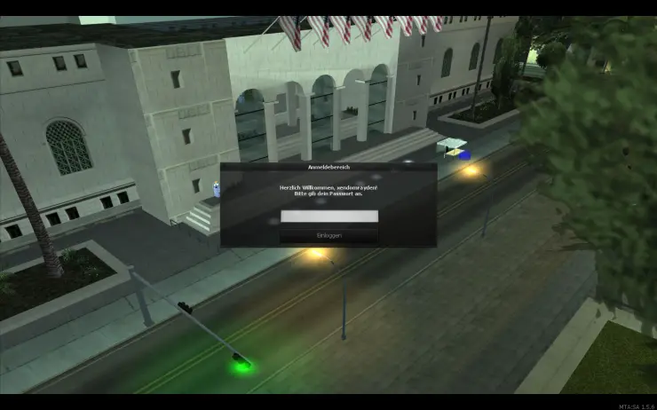
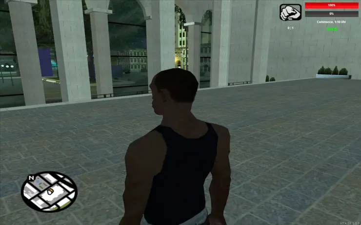
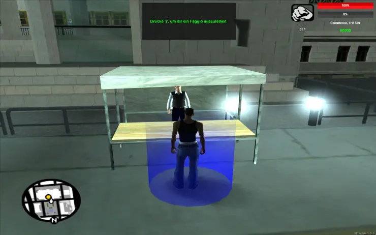
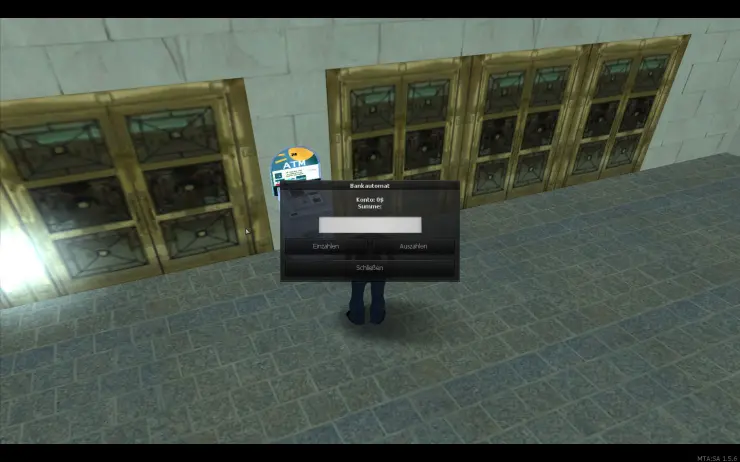
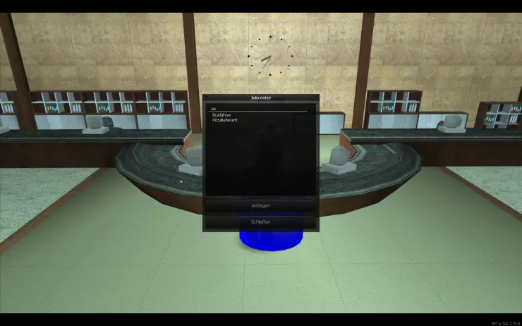
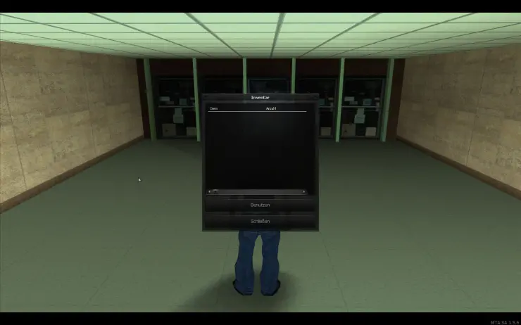
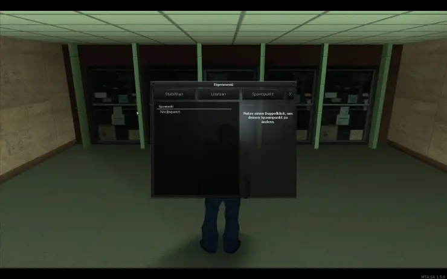

# MTA Roleplay Basic Framework

A roleplay framework that was developed in 2018.

|Category|Amount|
|---|---|
LUA files|51|
other files|47|
functions|198|
lines|2395|
characters|104456|
comment-lines|36|
comment-characters|761|

  
  
     
  
  
     
  
  

