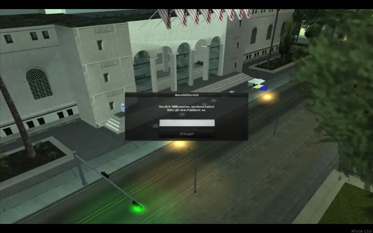
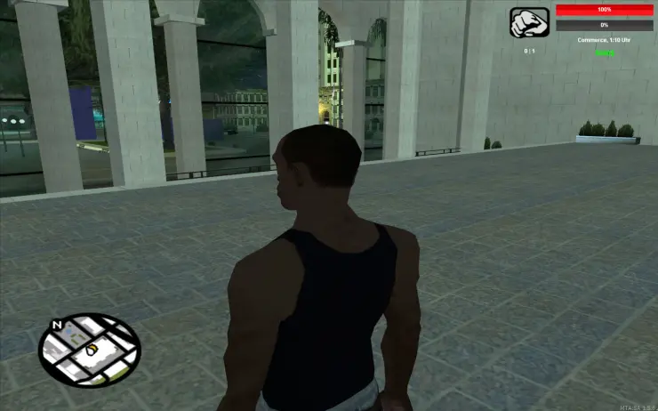
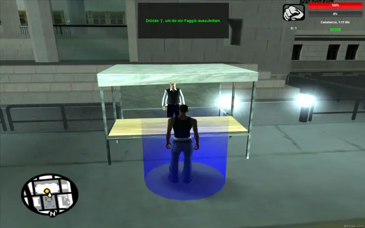
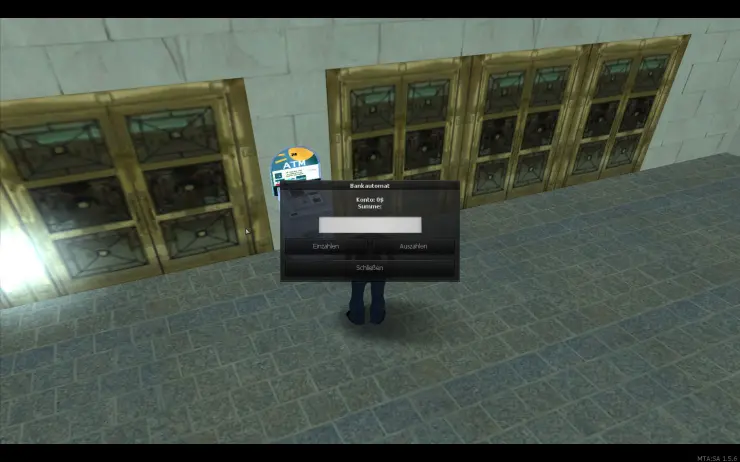
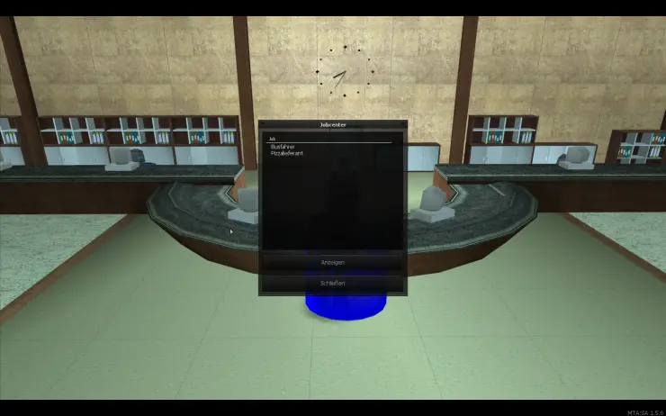
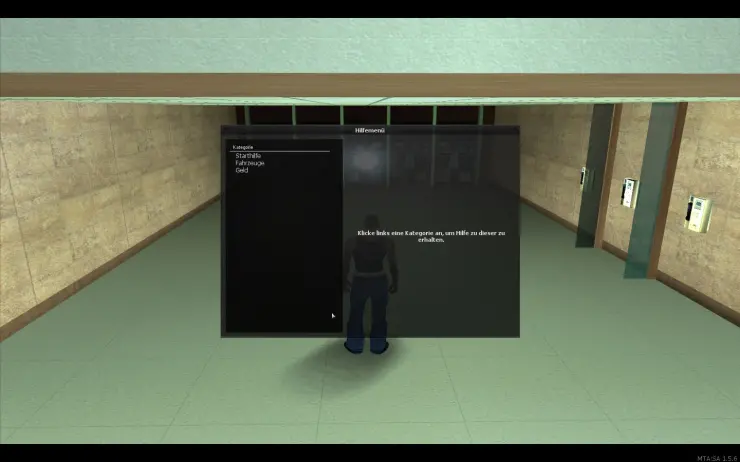
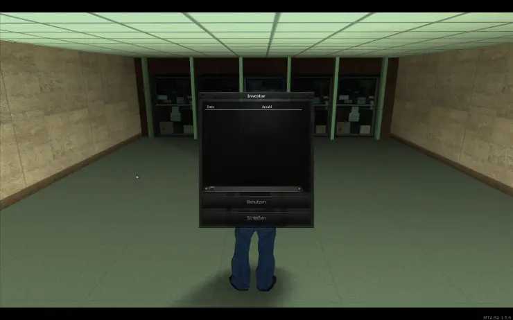
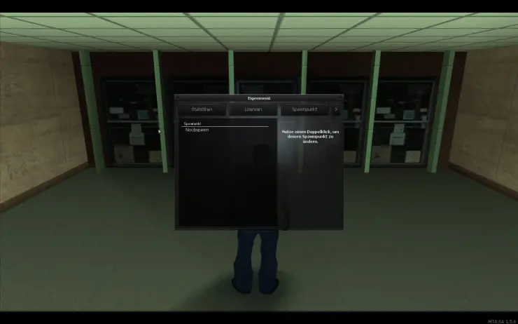

# Roleplay Framework

This is a basic roleplay gamemode for Multi Theft Auto: San Andreas (MTA:SA), developed in Lua.

The framework provides a simple foundation for creating your own roleplay server. It already includes the essential systems needed to start developing and can easily be extended with additional factions, jobs and gameplay features.

## Features

The framework includes a MySQL-based account system with persistent player data, a faction and rank system, jobs, personal vehicles, houses, licenses, banking and a basic inventory.

Several gameplay systems are already implemented, including a driving school, gas stations and fuel system, Ammu-Nation, supermarket, payday system, vehicle management and different interiors.

### Included Factions

* LSPD
* Yakuza
* Biker
* Reporter

### Included Jobs

* Bus Driver
* Pizza Delivery Driver

## Additional Systems

The framework also includes a custom HUD, scoreboard, help menu, player menu, administration system, faction management, vehicle management and several custom maps.

## Installation

1. Place `RoleplayBasicFramework` inside your MTA server's `resources` directory.
2. Set up the required MySQL database.
3. Configure the database connection in `Main-server.lua`.
4. Start the resource on your MTA server.

## 🎬 Media

  
  
     
  
  
     
  
     

## 📊 Statistics

| Category           | Amount |
| ------------------ | -----: |
| LUA files          |      51 |
| other files        |      48 |
| functions          |      211 |
| lines              |      2456 |
| characters         |      106494 |
| comment-lines      |      36 |
| comment-characters |      761 |
